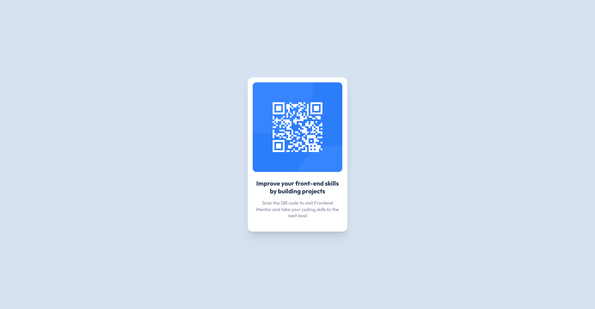

# 🧩 Proyecto: Componente QR Code

Este proyecto consiste en el desarrollo de un **componente de Código QR** utilizando **Astro** y **Tailwind CSS**.  
El objetivo es aplicar los conocimientos sobre **componentes**, **maquetación**, **estilos responsivos** y **utilidades CSS** para construir un diseño limpio, moderno y adaptable a diferentes dispositivos.

---

## 📖 Descripción general

### 🧩 Vista previa del proyecto
Agrega aquí una **captura de pantalla** del resultado final de tu componente.  
> Puedes usar la herramienta de captura del navegador o cualquier software de tu preferencia.

---

### 🔗 Enlaces del proyecto

- **Repositorio en GitHub:** https://github.com/Jontrix/qr.git
- **Sitio desplegado (opcional):** https://proyecto-ht5b8s1h6-jovaniva66-7689s-projects.vercel.app/

---

## 🧠 Proceso de desarrollo

### 🛠️ Tecnologías utilizadas
Lista las herramientas y tecnologías que utilizaste en el proyecto. Por ejemplo:

- [Astro](https://astro.build)
- [Tailwind CSS](https://tailwindcss.com/)
- HTML5 semántico
- Diseño responsivo (Mobile-first)
- Componentes reutilizables

---

### 💡 Lo que aprendí
En este proyecto aprendí a usar Astro para separar mi código en componentes, lo que hace que todo sea más ordenado. También reforcé cómo usar las clases de Tailwind CSS para darle estilos rápidos a las cajas y al texto sin tener que escribir mucho CSS manual. Entendí que las imágenes y el favicon siempre deben ir en la carpeta public para que el navegador los encuentre a la primera.

<article class="bg-white p-4 rounded-2xl shadow-xl max-w-[320px] text-center">
  
</article>

---

### 🚀 Áreas de mejora

Menciona aquí los aspectos que podrías mejorar o seguir practicando en futuros proyectos.

Practicar más cómo hacer que los diseños se vean perfectos en cualquier tamaño de celular.

Aprender a ponerle animaciones sencillas, como que la tarjeta se mueva un poquito al pasar el mouse.

Mejorar el orden de mis carpetas cuando los proyectos se vuelvan más grandes.

Seguir practicando con la terminal para no confundirme tanto con las rutas de las carpetas.  

---

### 📚 Recursos útiles

Incluye los enlaces, documentación o tutoriales que te ayudaron a completar este proyecto.

**Ejemplo:**
- [Documentación de Astro](https://docs.astro.build)  
- [Guía oficial de Tailwind CSS](https://tailwindcss.com/docs)  
- [MDN Web Docs - HTML y CSS](https://developer.mozilla.org/es/)  
- [Guía de diseño responsivo](https://web.dev/responsive-web-design-basics/)  
- mis amigos me ayudaron tambien cuando me trababa.
---

### 👩‍💻 Autor

- **Nombre completo:**  Jovani Vargas Muñoz
- **Carrera:**  TICS
- **Grupo:**  11 AM
- **Correo institucional:**   23151318@aguascalientes.tecnm.mx

---

### ✨ Reflexión final

Comparte brevemente tu experiencia durante el desarrollo del proyecto.  
Puedes responder a preguntas como:

¿Qué fue lo más fácil o lo más difícil de realizar?
Lo más fácil fue armar la estructura básica de la tarjeta con el texto y la imagen. Lo más difícil, sin duda, fue pelearme con la terminal al principio para que Tailwind funcionara bien y entender por qué no encontraba mis archivos por estar en la carpeta equivocada o por los problemas de rutas con OneDrive.

¿Qué parte disfrutaste más del desarrollo?
Lo que más disfruté fue ese momento en el que por fin cargaron los estilos y vi la tarjeta blanca bien centrada con su fondo azul. Se siente muy bien ver que el código que escribes sí hace que las cosas se vean exactamente como en el diseño original.

¿Qué conceptos nuevos aprendiste?
Aprendí a usar Astro y cómo separar las cosas en componentes para que el código sea más ordenado. También aprendí a usar las clases de Tailwind para no tener que escribir archivos CSS gigantes y cómo usar comandos de la terminal como cd para moverme entre carpetas y npm run dev para ver mis cambios en vivo.

¿Cómo aplicarías lo aprendido en proyectos futuros?
Lo voy a usar en mis siguientes tareas para hacer mis páginas mucho más rápido con Tailwind y que se vean más profesionales. También, ahora que ya sé cómo manejar mejor la terminal y las carpetas del proyecto, no me voy a trabar tanto cuando algo no quiera cargar a la primera.
